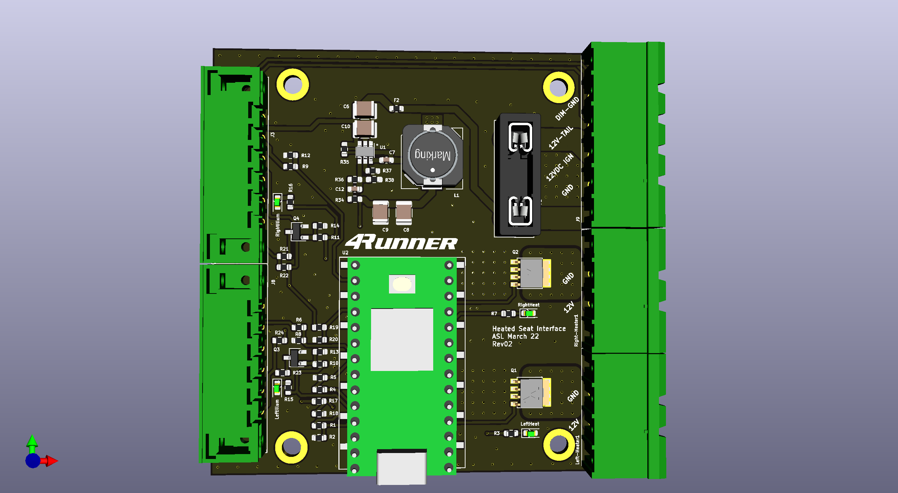
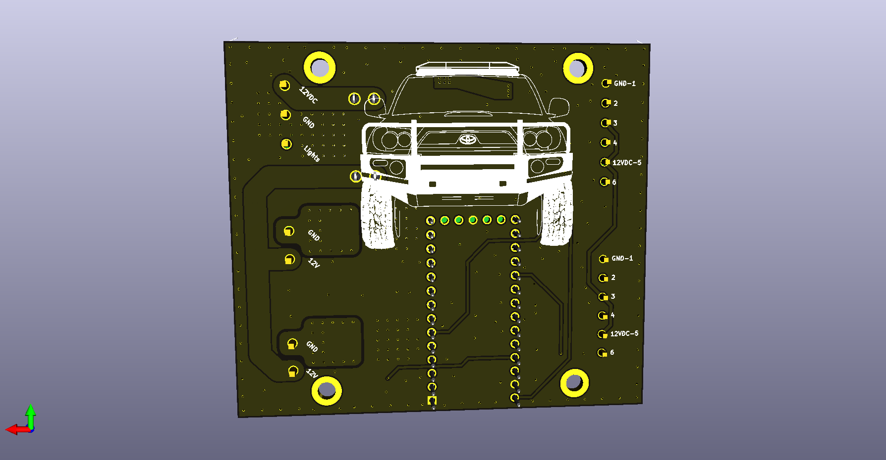

# 4Runner Heated Seat Control Board

## Pictures

## Schematic
[Schematic](exports/4runner-seat-heat-rev01-1-schematic.pdf)

## BOM
[Interactive BOM](exports/BOM/ibom.html)

## Gerbers
[Gerber](exports/Gerbers)

## Fab Instructions
| | |
|-------------------|---------------:|
| Height (mm)       | 75             |
| Width (mm)        | 67             |
| Layers            | 2              |
| Thickness (mm)    | 1.6            |
| Solder Mask       | Black          |
| Silkscreen        | White          |
| Copper Thickness  | 1 oz           |
| Min Spacing       | 8/8mil         |
| Min Hole Size     | 8mil           |
| Via Process       | Tented         |
| Surface Treatment | HASL-Lead Free |
| Special Notes     | None           |

